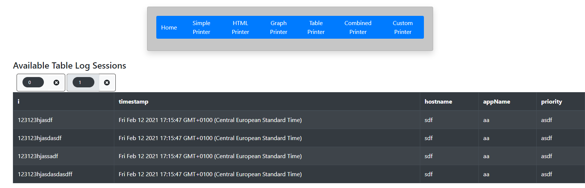
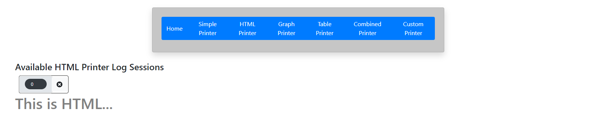
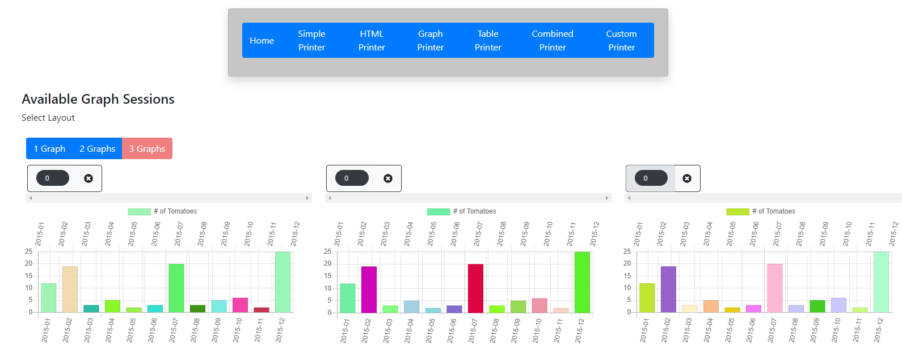
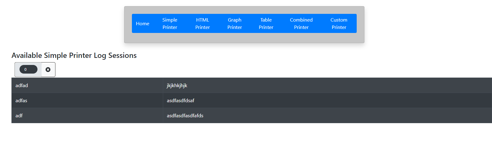
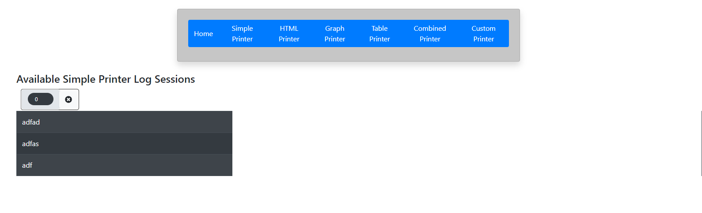

> Installation guide and usage guide for DownSpiral

# Installation Guide

## Perquisites

- npm package manager
- npm package serve installed globally `npm install -g serve`

## Installation

- Clone the repo in desired directory
  `git clone https://github.com/alphasr/down-spiral.git`
   
- Start React App
  `cd down-spiral/frontend`
  `npm run serve-build`
   

- Start Socket.io server
  `npm run server`

## Usage

### Types of loggers

- Table Printer
- HTML Printer
- Graph Printer
- Simple Printer
- Custom Printer
- Combined Printer

### Table Printer

Table printer is a logger that logs the data as HTML Table

  

#### Usage

Accepts a json payload of type:
`{SessionId: string, header: string[], data: any[]`}

Socket.io event for Table Printer:
`'TABLE_PRINTER'`

Complete Usage
<code>.emit('TABLE_PRINTER', {
&nbsp; SessionId: string,
&nbsp; header: string[],
&nbsp; data: any[]`
&nbsp; }
)</code>

### HTML Printer

HTML printer is a logger that logs the data as HTML

  

#### Usage

Accepts a json payload of type:
`{SessionId: string, htmlPayload: string`}

Socket.io event for Table Printer:
`'HTML_PRINTER'`

Complete Usage
`.emit('HTML_PRINTER', {SessionId: string, htmlPayload: string`})`

### Graph Printer

GRAPH printer is a logger that logs the data as Graph

  

#### Supported Graphs

- BAR
- SCATTER
- RADAR
- LINE
- DOUGHNUT
- POLAR-AREA
- BUBBLE

#### Usage

Accepts a json payload of type:
<code>{
SessionId: string,
type:string,labels: string[],
datasets:{
&nbsp; label:string,
&nbsp; data: any[]
&nbsp; }
}</code>
Socket.io event for Table Printer:
`'GRAPH_PRINTER'`
Complete Usage
<code>.emit('GRAPH_PRINTER', {
&nbsp; SessionId: string,
&nbsp; type:string,
&nbsp; labels: string[],
&nbsp; datasets:{
&nbsp; &nbsp; label:string,
&nbsp; &nbsp; data: any[]
&nbsp; &nbsp; }
&nbsp; }
)</code>

### Simple Printer

SIMPLE printer is a logger that logs the data as Key value pairs

  
  

#### Usage

Accepts a json payload of type:
<code>{
SessionId: string,
data: {id: string, resultLable:string, resultValue:string} []
}</code>

Socket.io event for Table Printer:
`'SIMPLE_PRINTER'`

Complete Usage
<code>.emit('SIMPLE_PRINTER', {
&nbsp;SessionId: string,
&nbsp;data: {id: string, resultLable:string, resultValue:string} []
&nbsp;}
)</code>

### Combined Printer

  

COMBINED printer is a logger that logs the data from other chosen printers

#### Usage

Accepts a json payload of type:
<code>{
sessionId: string;
grid: number;
combinedViewsPayload: { type: string; sessionId: string }[];
}</code>
here type can be any other logger type, passed with respective sessionId.

Socket.io event for Table Printer:
`'COMBINED_PRINTER'`

Complete Usage
<code>.emit('COMBINED_PRINTER',{
&nbsp;sessionId: string;
&nbsp;grid: number;
&nbsp;combinedViewsPayload: { type: string; sessionId: string }[];
&nbsp;}
)</code>

### Custom Printer

CUSTOM printer is a logger that's defined by the user.
In CUSTOM_PRINTER user defines the json object and it's mapping with JSX in the file CustomPrinter.JSX

#### Usage

- Define your custom json in the interface
  `ICustomPrinterPayload { sessionId: string, data: any[] } `
  expand data object to your need, must have a unique `id:string`
- Map your objects to JSX Component
  > Note: Redux state mapping is already configured to the interface

Socket.io event for Table Printer:
`'CUSTOM_PRINTER'`

Complete Usage
<code>.emit('CUSTOM_PRINTER',{
&nbsp;sessionId: string;
&nbsp;data: any[];
&nbsp;}
)</code>
